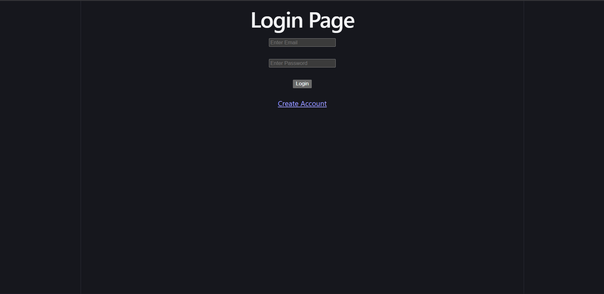
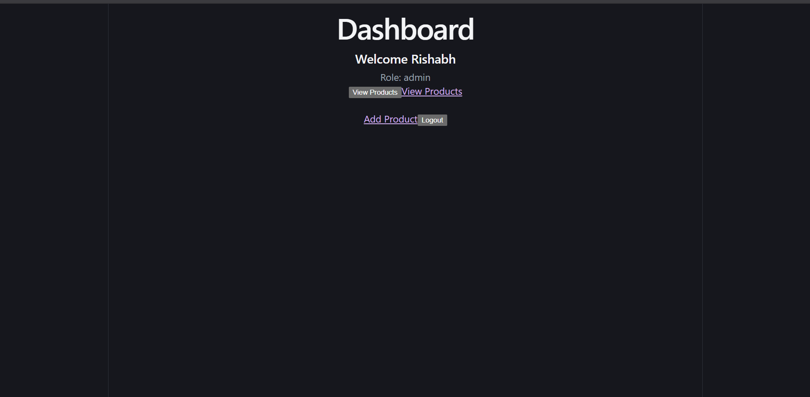
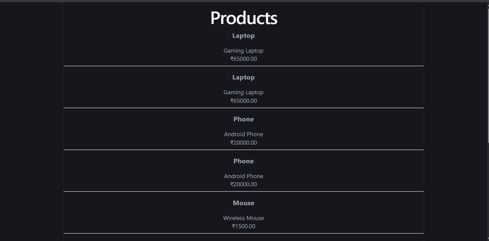
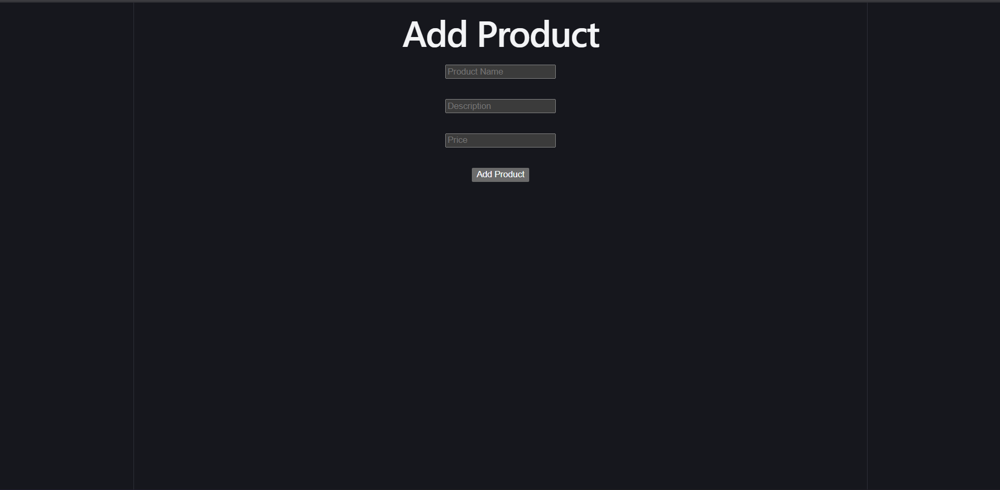

# Backend App Assignment

A full-stack role-based authentication and product management application built using React, Node.js, Express, MySQL, and JWT Authentication.

## Features

### Authentication
- User Registration
- User Login
- JWT Token Authentication
- Role-Based Access Control (Admin/User)

### Product Management
- View Products
- Add Products (Admin Only)
- Update Products (Admin Only)
- Delete Products (Admin Only)

### Frontend
- React.js
- React Router DOM
- Axios
- Responsive UI

### Backend
- Node.js
- Express.js
- MySQL
- JWT Authentication
- Middleware for Authentication & Authorization

---

## Project Structure

```text
backend/
│
├── controllers/
├── middleware/
├── routes/
├── app.js
├── .env
└── package.json

frontend/
│
├── src/
│   ├── pages/
│   ├── services/
│   ├── App.jsx
│   └── main.jsx
└── package.json
```

---

## Installation

### Backend

```bash
cd backend
npm install
npm start
```

Backend runs on:

```text
http://localhost:5000
```

### Frontend

```bash
cd frontend
npm install
npm run dev
```

Frontend runs on:

```text
http://localhost:5173
```

---

## Environment Variables

Create a `.env` file inside the backend folder.

```env
PORT=5000

DB_HOST=localhost
DB_USER=root
DB_PASSWORD=
DB_NAME=backend_app

JWT_SECRET=your_secret_key
```

---

## API Endpoints

### Authentication

#### Register

```http
POST /api/v1/auth/register
```

#### Login

```http
POST /api/v1/auth/login
```

---

### Products

#### Get All Products

```http
GET /api/v1/products
```

#### Create Product (Admin Only)

```http
POST /api/v1/products
```

#### Update Product

```http
PUT /api/v1/products/:id
```

#### Delete Product

```http
DELETE /api/v1/products/:id
```

---

## Technologies Used

- React.js
- Node.js
- Express.js
- MySQL
- JWT
- Axios
- React Router DOM

---

## Application Screenshots

### Login Page



---

### Dashboard



---

### Products Page



---

### Add Product Page



## Author

**Rishabh Brahmane**
